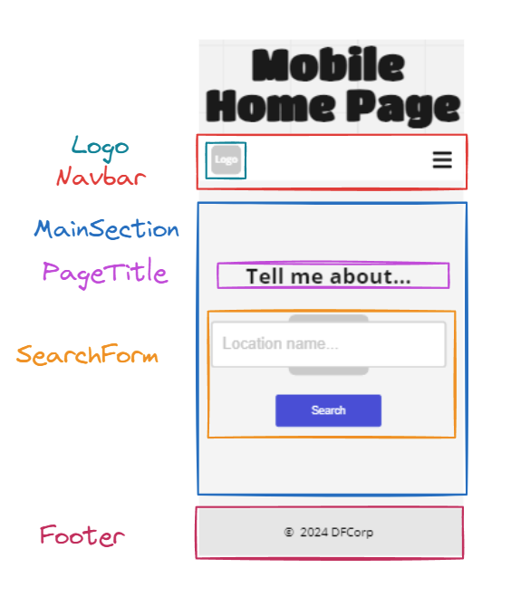
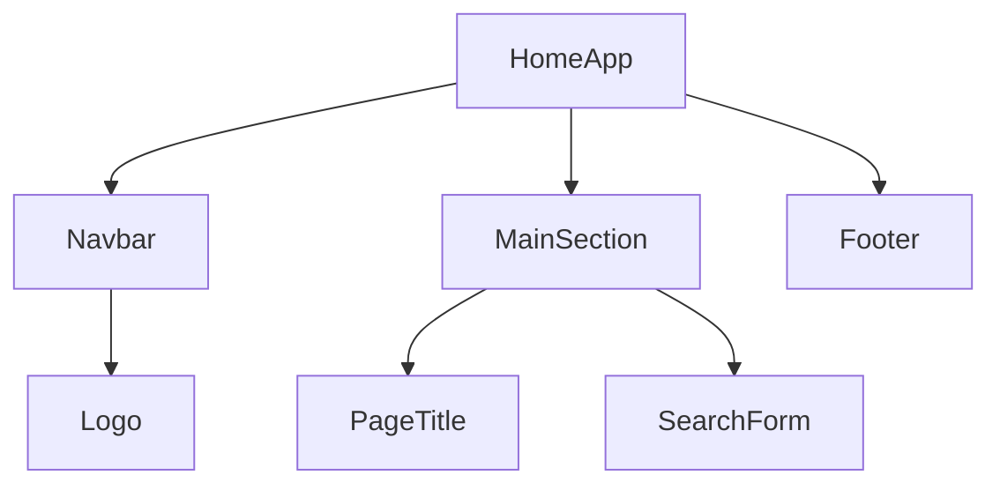
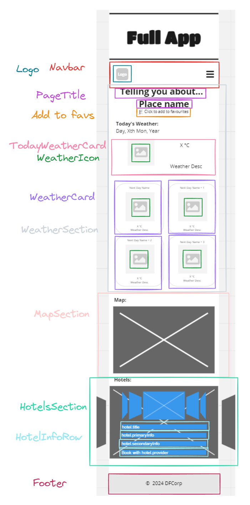
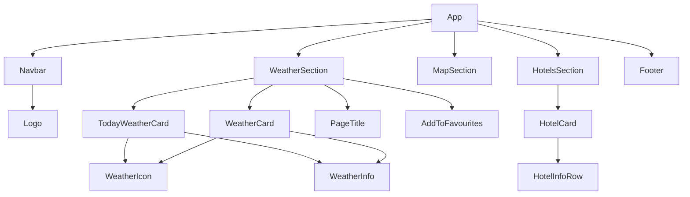
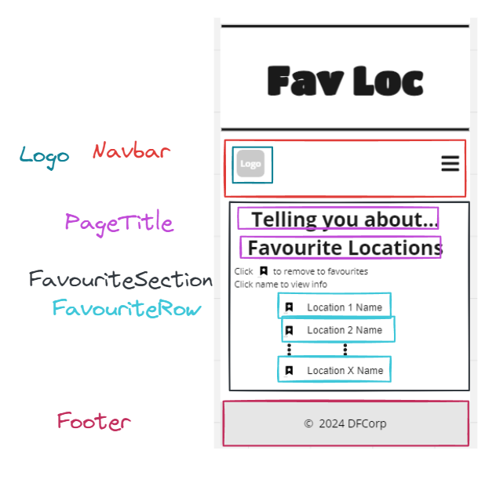
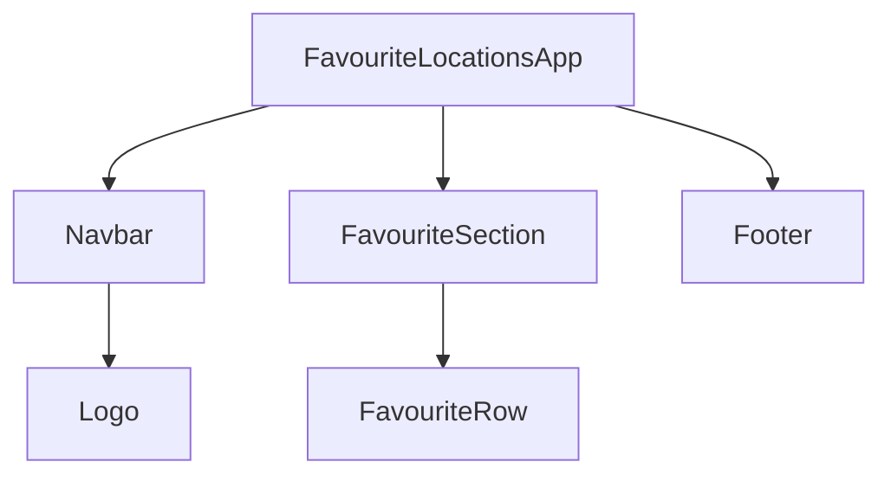

# React component hierarchy and plan

---

Based on the wireframes and user stories, I have come up with the following component hierarchy:

## Home page

## Full app

## Favourite locations page

